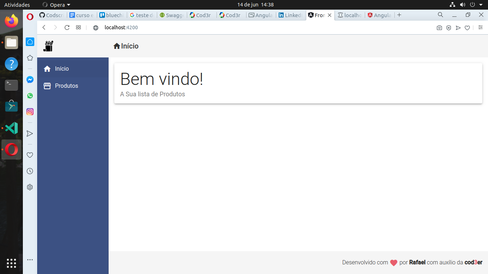
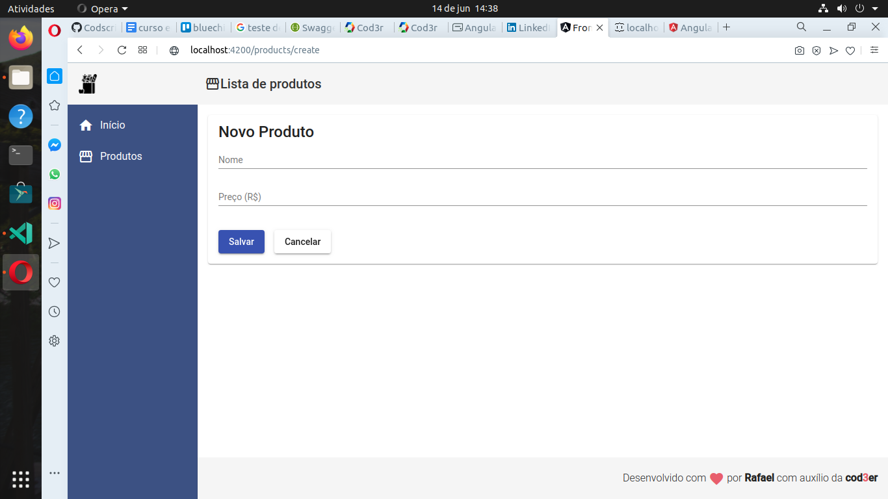
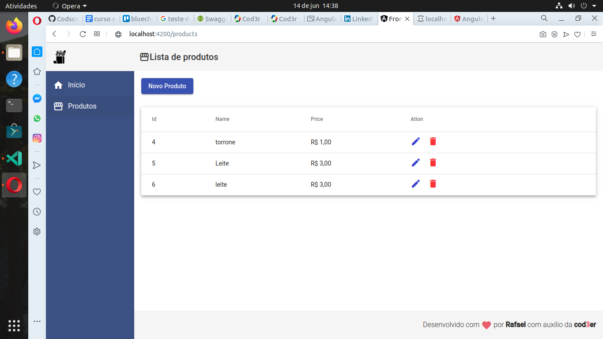
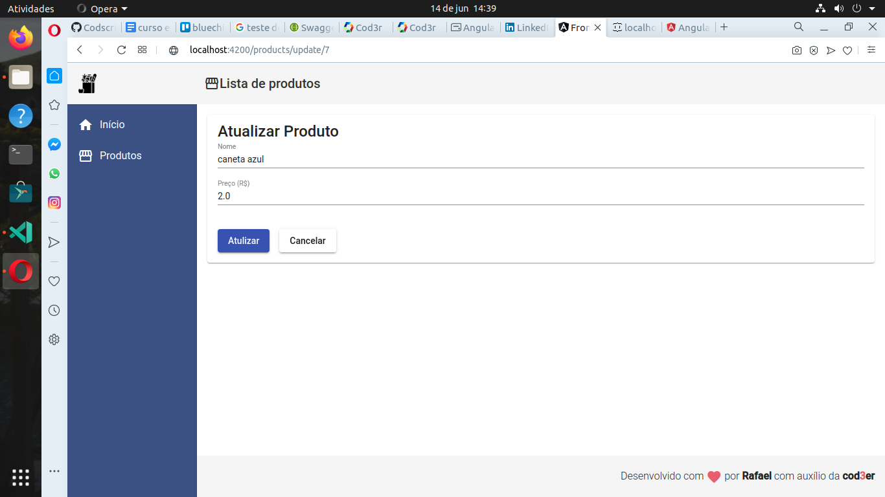
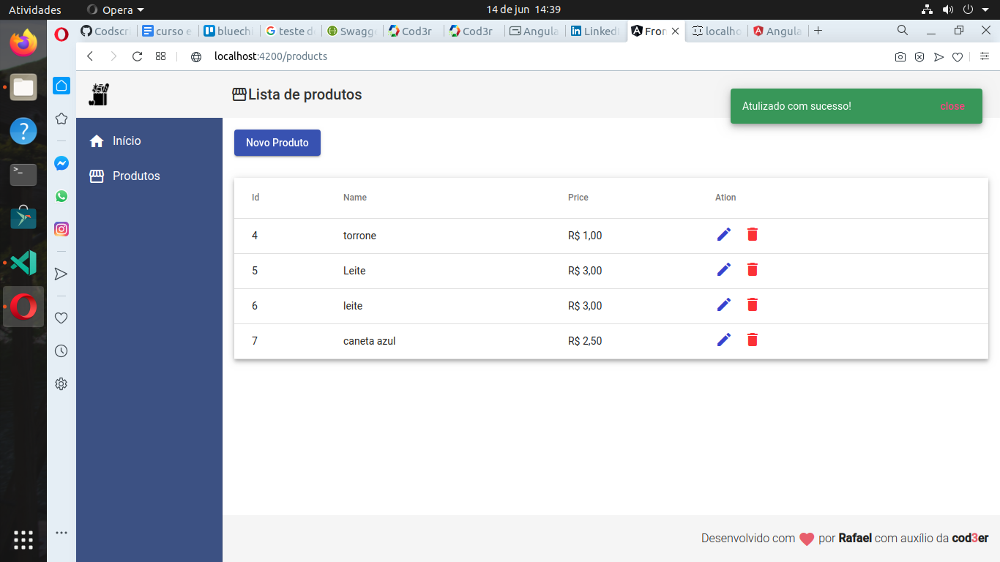
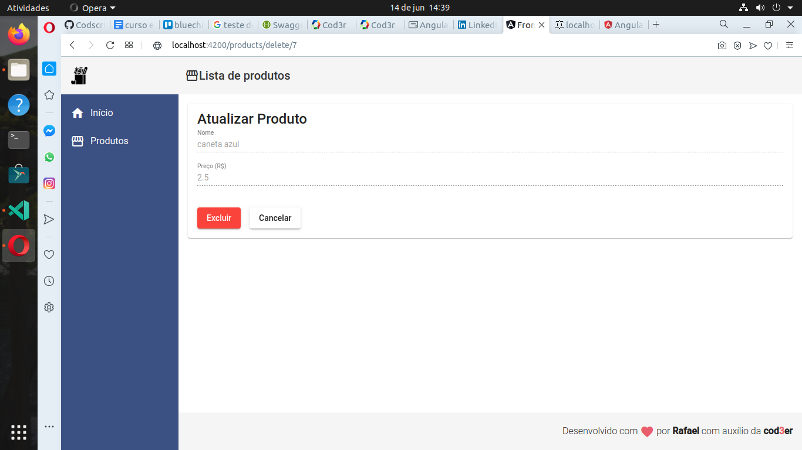
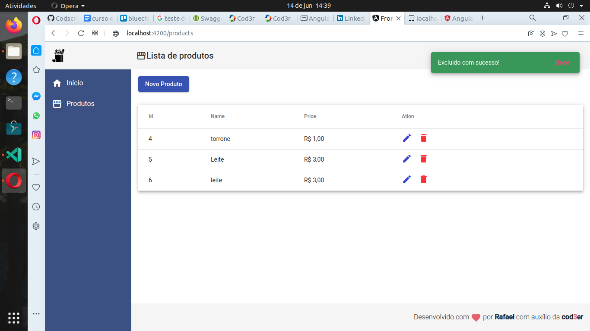

# Progeto do curso de Angular 9 essencial da cod3r na Udemy

Crud com api json criada usando json-server manipulando pakaeg.json.

Criando um projeto angular minimal com o minimo de dependencias para o projeto.

[Link do curso gratuito na udemy](https://www.udemy.com/share/102Sq6BEQedl9aTHw=/)

## Comandos de criação de projetos, componentes, services e etc..

No link abaixo  da documentação Agular, para uso dos comandos de criação no terminal.
[Link com infomações para criar usando 'ng g' componentes, models, Services e etc...](https://angular.io/cli/generate)

## Crud completo abaixo...

Tela de início apresentação

Tela de Produto formulario `Create`

Tela de mensagem `Creat`

Tela lista de Produtos  `Read`

Tela de Produto formulario `Update`

Tela de mensagem `Update`

Tela de Produto `Delete`

Tela de mensagem `Deletar`

